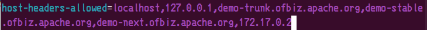

# distrubuted_system_ofbiz
### 匯入docker image
--------------------------
下載位置: https://drive.google.com/drive/folders/1mJ1B5-5m9W4SZ-tGZUAqIIvUj1ssjQxC?usp=drive_link

匯入檔案
```
docker load < docker_image_ofbiz.tgz
```

### 執行OFBiz
--------------------------
切換目錄到OFBiz安裝的目錄
```
cd /usr/local/apache-ofbiz
```

打開framework/security/config/security.properties，將docker image的IP加入host-headers-allowed


執行ofbiz
```
cd /usr/local/apache-ofbiz
./gradlew ofbiz
```

### 存取OFBiz的頁面
--------------------------
https://[docker_IP]:8443/myportal/control/main
帳號：admin
密碼：ofbiz

### 執行Demo
--------------------------
將這個專案clone到/usr/local/apache-ofbiz/plugins底下，接著執行以下指令

```
./gradlew loadall ofbiz
```

### 參考資料
--------------------------
reference: https://tecadmin.net/steps-to-install-apache-ofbiz-on-linux-system/
